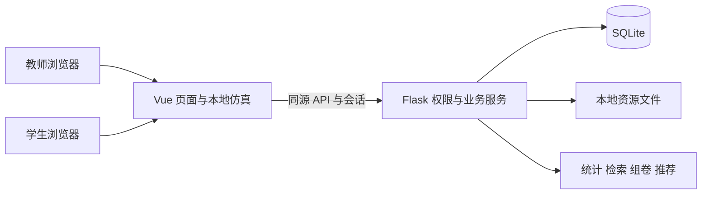

# 架构决策记录

版本：设计基线 1.0，2026-09-28。以下是待实现的设计选择，评审后作为实现依据。

## ADR-001 单课程模块化单体

采用 Vue 3 单页前端和 Flask REST API，后端以应用工厂和 Blueprint 划分 auth、attendance、content、assessment、experiment、analytics、intelligence。应用工厂便于独立测试配置，参考 [Flask 官方说明](https://flask.palletsprojects.com/en/stable/patterns/appfactories/)。接口层负责校验和权限，服务层负责状态转换，模型层负责约束。模块共用一份 SQLite 数据。

课堂规模较小，课程要求固定 Flask/SQLite，选择单体可减少启动和部署步骤。本期不引入微服务、消息队列或 Redis；代价是只能承诺经负载测试确认的单实例课堂规模。

## ADR-002 教师课堂优先

依据 PRD 和调研，首先实现演示、预测、短测与讲评。教师首页突出“进入课堂”，学生首页突出“当前活动”。不以管理员风格的大屏指标作为首页主体。统一把 Q(t)、输入、Q(t+1) 标出来，以减少对状态术语的混淆。

## ADR-003 自行实现有限仿真

仅实现四类预置离散模型；输入事件、时钟半周期和复位明确，前后端使用同一套规格与测试向量。前端提供即时单步，后端独立验证正式实验及共享演示动作。这样核心流程无外网依赖，也能控制教学语义；代价是不支持任意搭线或物理时序精度。相关产品依据见调研 R01/R03/R04，规则来源见 R10。

## ADR-004 会话认证与班级隔离

采用随机会话标识 Cookie，数据库只存标识散列；Cookie 为 HttpOnly、SameSite=Lax，HTTPS 下启用 Secure。登录前创建短时 CSRF 会话，登录成功轮换标识；所有写请求校验 CSRF。匿名会话 30 分钟、登录会话绝对有效期 8 小时，不无限续期。退出删除会话，角色和 active 每次检查。

不采用 localStorage 存长期访问令牌。服务层同时验证对象所属班级与角色，隐藏路由不能代替后端鉴权。公开注册只允许学生，管理员分配有效班级。登录失败统一消息；采用进程内短期限流，单实例重启会清空限流计数，此限制在部署说明中保留。

## ADR-005 SQLite 与历史快照

遵循任务书，统一 SQLite；外键需每连接开启，见 [SQLite 官方说明](https://www.sqlite.org/foreignkeys.html)。使用短事务、唯一约束和版本号处理竞争。测评发布固定题目及名单快照，资源版本不可变，避免教学内容更新导致历史成绩被改写。使用 Alembic 迁移，数据库和文件备份作为一个恢复集合。

## ADR-006 课堂同步和截止判定

采用约 3 秒一次轮询，不宣称毫秒级实时同步。页面隐藏停止轮询，回到前台立刻刷新；连续失败显示断线和最后同步时间。服务器返回 server_time 与活动时间；截止以服务器接收时间为准。截止后在相关读取或提交事务入口调用幂等 finalize 服务处理已开始草稿，无需首版部署后台队列；即使无访问暂未落库，业务有效状态仍按 ends_at 计算，不允许迟交。

教师动作使用 expected_version，过期返回 409，客户端重新获取后由教师决定重试，不能自动覆盖新的演示状态。

## ADR-007 四项轻量算法

1. 问答：scikit-learn TF-IDF，字符 2—4 gram，余弦检索，最多 3 条来源。参考 [TfidfVectorizer](https://scikit-learn.org/stable/modules/generated/sklearn.feature_extraction.text.TfidfVectorizer.html)。不接收费外部服务；相似度不当作正确概率。
2. 组卷：NumPy 建立覆盖与难度矩阵，SciPy `milp` 进行二元约束选题。候选最多 500，题量最多 30，求解限时 2 秒；超时和数学无解必须区分，参考 [SciPy milp](https://docs.scipy.org/doc/scipy/reference/generated/scipy.optimize.milp.html)。相比简单随机抽题增加一个求解步骤，换取约束可检验性。
3. 预警：Pandas 聚合，NumPy 加权评分，数据充分时用 scikit-learn KMeans 补充班级分组描述；不把无监督分组当作挂科预测。冷启动仅提供规则评分或样本不足。
4. 推荐：按错题、进度和实验表现计算内容排序，输出原因与对应知识点；无需训练复杂模型。

不使用 PyTorch/TensorFlow，不下载大模型。算法参数和评价用例写入 Spec，不把安装了某个库视为算法已完成。

## ADR-008 文件与内容安全

只允许 PDF、PPTX、PNG、JPEG，单文件不超过 20 MiB；视频使用外链，不自动抓取远程 URL。上传文件放不可直接执行的目录，以随机 storage_key 保存；下载接口验证权限，默认附件输出。Markdown 关闭原始 HTML，输出仍净化；外链仅允许 http/https。预习和题目内容变化用快照控制。

## ADR-009 运行和版本选择

工程阶段锁定兼容的 Python、Node 和全部依赖版本，当前不填写未经安装验证的精确版本。实际服务采用生产 WSGI 服务，参考 [Flask 部署说明](https://flask.palletsprojects.com/en/stable/deploying/)，Windows 首选 Waitress，前端构建后同源提供。Docker/Nginx 为扩展项，不影响首版启动。

## ADR-010 设计变更流程

PRD 定义范围，APIC 定义接口，DBD 定义数据，Spec 定义模块规则与验收，测试计划记录覆盖。发生冲突先修正文档再实现，记录到 CHG-RB。当前只生成文档，尚无应用与数据库；Git 仓库已初始化，应用工程仍未创建。所有运行性能、算法效果和用户使用效果仍待实现验证。
