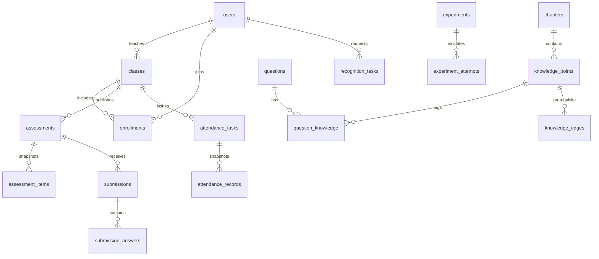

# 数据库设计

版本：设计基线 1.0，2026-09-28。数据库：SQLite。本文定义计划模型，当前未创建数据库或迁移文件。

## 1 公共约定

主键为 INTEGER，接口用正整数表示。除关联表外，各表均有 `id`、`created_at`；可编辑实体另有 `updated_at` 和 `version INTEGER NOT NULL DEFAULT 1`。时间以 UTC ISO 8601 TEXT 保存，接口带 Z，页面按 Asia/Shanghai 显示。`?` 表示可空；其余字段 NOT NULL。布尔使用 INTEGER CHECK IN (0,1)，枚举用 CHECK，JSON 使用 TEXT 并由服务层验证结构和大小。

版本号用于乐观并发：PATCH 携带当前 version，修改时原子比较并递增，不匹配返回 409。关联表无独立 version。业务历史一律保留，软停用和归档代替删除已使用数据。账号密码只保存安全散列；会话和签到码保存散列，不保存明文。

所有连接执行 `PRAGMA foreign_keys=ON` 和 `PRAGMA busy_timeout=5000`。开发与部署都使用 SQLite，不在共享网络盘上访问数据库。WAL 在工程阶段验证后启用，备份通过 SQLite backup API 或停服一致性复制，不在写入期间只复制主 db 文件。

## 2 用户和班级

| 表 | 字段，不含公共字段 | 约束与索引 |
| --- | --- | --- |
| users | login_name TEXT(32)、student_no TEXT(20)?、display_name TEXT(50)、password_hash TEXT、role TEXT(student/teacher/admin)、active BOOL | UNIQUE(login_name)、UNIQUE(student_no)，学生必须有 student_no；不允许自助注册高权限角色 |
| sessions | token_hash TEXT、user_id FK users?、csrf_hash TEXT、expires_at TEXT、last_seen_at TEXT | UNIQUE(token_hash)，INDEX(expires_at)；未登录 CSRF 会话 user_id=null；注销删除会话 |
| classes | name TEXT(80)、teacher_id FK users、active BOOL | INDEX(teacher_id,active)，服务层确保教师角色 |
| enrollments | class_id FK classes、student_id FK users、active BOOL、joined_at TEXT、left_at TEXT? | UNIQUE(class_id,student_id)，部分唯一索引 student_id WHERE active=1，学生最多一个有效班级 |

角色、禁用状态每次请求检查；角色变更或账号停用时使所有会话失效。停用班级后禁止新活动，但历史查询仍可用。

## 3 课程内容和备课

| 表 | 字段 | 约束与索引 |
| --- | --- | --- |
| chapters | title TEXT(100)、sort_order INTEGER、published BOOL、owner_id FK users | sort_order≥0；按顺序展示 |
| knowledge_points | chapter_id FK chapters、title TEXT(100)、body_md TEXT、source_url TEXT?、sort_order INTEGER、published BOOL、owner_id FK users | INDEX(chapter_id,published)；Markdown 禁止原始 HTML，输出净化 |
| knowledge_edges | prerequisite_id FK knowledge_points、target_id FK knowledge_points | 复合主键，两端不同；服务层检测环，最多 1000 条边 |
| resources | title TEXT(100)、category TEXT(slides/guide/reference/video)、knowledge_id FK knowledge_points?、published BOOL、owner_id FK users | INDEX(category,published) |
| resource_versions | resource_id FK resources、version_no INTEGER、kind TEXT(file/link)、storage_key TEXT?、original_name TEXT?、mime TEXT?、size_bytes INTEGER?、sha256 TEXT?、external_url TEXT?、note TEXT(200) | UNIQUE(resource_id,version_no)；file 要求文件字段，link 要求 URL；追加后不可修改 |
| favorites | student_id FK users、knowledge_id FK knowledge_points | 复合主键，删除收藏允许物理删除 |
| learning_progress | student_id FK users、knowledge_id FK knowledge_points、completed BOOL、completed_at TEXT? | UNIQUE(student_id,knowledge_id)，完成为自报记录，不存“掌握分” |
| resource_events | student_id FK users、resource_version_id FK resource_versions、event_kind TEXT(open/download)、event_day TEXT | UNIQUE(student_id,resource_version_id,event_kind,event_day)，按 UTC 日去重，统计名称为去重访问事件 |
| lesson_plans | title TEXT(100)、owner_id FK users、planned_at TEXT?、notes TEXT | INDEX(owner_id) |
| lesson_plan_items | plan_id FK lesson_plans、sort_order INTEGER、knowledge_id FK knowledge_points?、resource_version_id FK resource_versions?、question_id FK questions?、experiment_id FK experiments? | CHECK 四个目标恰好一个非空；UNIQUE(plan_id,sort_order) |
| preview_assignments | plan_id FK lesson_plans、class_id FK classes、due_at TEXT?、snapshot_json TEXT | 发布时固定备课条目及内容摘要、资源版本；INDEX(class_id,created_at) |

课程内容在本系统内共享：有有效选课的学生可查看已发布材料，教师可引用已发布材料。草稿仅所有者可读写。备课发布面向一个班级，复制备课单复制条目关系而不复制文件；发布后的预习快照不随原计划改变。知识点一经关联不硬删除，正文修改保留版本号；既有测评保留题目与标签快照。

## 4 考勤

| 表 | 字段 | 约束与索引 |
| --- | --- | --- |
| attendance_tasks | class_id FK classes、title TEXT(100)、opens_at TEXT、late_at TEXT、closes_at TEXT、code_hash TEXT、settled_at TEXT?、owner_id FK users | opens_at≤late_at<closes_at；INDEX(class_id,opens_at) |
| attendance_records | task_id FK attendance_tasks、student_id FK users、status TEXT(pending/present/late/leave/absent)、signed_at TEXT? | UNIQUE(task_id,student_id)，发布时按有效名单生成 pending |
| leave_requests | task_id FK attendance_tasks、student_id FK users、reason TEXT(300)、status TEXT(pending/approved/rejected)、reviewer_id FK users?、review_note TEXT(200)?、reviewed_at TEXT? | UNIQUE(task_id,student_id)；引用名单中的记录；INDEX(status) |

缺勤结算只更新仍 pending 的记录。先签到后获批请假不覆盖已发生签到，审批返回冲突；获批请假后不再允许签到。结束前可申请请假；结束后可审批尚未处理的请求，批准后将 absent 改为 leave，并更新后续统计，不保留过期缓存。审批历史保留于记录字段，首版不支持反复撤销审批。

## 5 题库和测评

| 表 | 字段 | 约束与索引 |
| --- | --- | --- |
| questions | type TEXT(single/multiple/boolean)、stem_md TEXT、options_json TEXT、answer_json TEXT、explanation_md TEXT、difficulty INTEGER、owner_id FK users、published BOOL | difficulty 1/2/3；选项唯一 key；单选一个答案，多选≥2，判断 true/false；修改递增 version |
| question_knowledge | question_id FK questions、knowledge_id FK knowledge_points | 复合主键，每题 1—3 个知识点，服务层保证 |
| assessments | class_id FK classes?、owner_id FK users、kind TEXT(practice/quiz/homework/exam)、title TEXT(100)、state TEXT(draft/published/closed)、starts_at TEXT?、ends_at TEXT?、feedback_released BOOL、total_score INTEGER、origin TEXT(manual/generated)、generation_json TEXT? | 教师测评必有 class_id；自练 class_id=null 且 owner 为学生；INDEX(class_id,state,ends_at) |
| assessment_items | assessment_id FK assessments、question_id FK questions、position INTEGER、points INTEGER、snapshot_json TEXT | UNIQUE(assessment_id,position)、UNIQUE(assessment_id,question_id)，points 1—100；快照含完整题目版本、答案、解析、知识点 ID 和名称 |
| assessment_roster | assessment_id FK assessments、student_id FK users | 复合主键，发布时固定名单；practice 只有创建学生 |
| submissions | assessment_id FK assessments、student_id FK users、status TEXT(draft/submitted)、started_at TEXT、submitted_at TEXT?、submit_reason TEXT(manual/timeout)?、score INTEGER?、final_request_hash TEXT? | UNIQUE(assessment_id,student_id)，INDEX(student_id,submitted_at) |
| submission_answers | submission_id FK submissions、item_id FK assessment_items、selected_json TEXT、correct BOOL?、awarded_points INTEGER? | UNIQUE(submission_id,item_id)，服务层验证题目属于同一测评 |

发布时，在一个事务中固定题目快照、分值、有效学生名单和起止时间。草稿可编辑，发布后不能改题或改班级；教师可提前结束，不可延长已结束测评。一次测评每学生一次提交，自练重练创建新的 practice；错题视图从历史作答推导，不另建重复事实表。

学生读取题目时服务器按权限投影 JSON，不将 answer/explanation 字段序列化后再靠前端隐藏。只有本人提交且反馈开放后，结果中才包含答案和解析。教师只能查看自己班级的测评结果。首答按 student_id + question_id 取最早已提交答案，基于当时快照判分；教学看板不跨学生公开个人成绩。

## 6 实验与课堂演示

| 表 | 字段 | 约束与索引 |
| --- | --- | --- |
| experiments | title TEXT(100)、knowledge_id FK knowledge_points、simulator_type TEXT(d/jk/counter/shift)、config_json TEXT、steps_md TEXT、input_sequence_json TEXT、published BOOL、owner_id FK users | 输入序列最多 128 个事件；配置规则见 SPEC-012；发布后修改递增版本并保留尝试快照 |
| experiment_attempts | experiment_id FK experiments、student_id FK users、experiment_snapshot_json TEXT、predictions_json TEXT、expected_json TEXT、passed BOOL、first_error_index INTEGER?、request_key TEXT | UNIQUE(student_id,request_key)，INDEX(experiment_id,student_id)；一个实验可多次尝试 |
| demo_sessions | class_id FK classes、experiment_id FK experiments、owner_id FK users、active BOOL、config_snapshot_json TEXT、state_json TEXT、event_log_json TEXT、reveal_next BOOL | 每班最多一个 active=1 的部分唯一索引；version 原子递增，事件最多 128 条；实验修改不改变进行中演示配置 |

仿真状态不等于学生答题记录。演示不保存学生姓名列表；学生个人仿真本地计算，正式实验提交按服务器保存的题目输入序列评分。实验预测必须包含每个要求检查点，后端从配置和输入重算，不采信客户端 passed/score。

## 7 统计与智能

| 表 | 字段 | 约束与索引 |
| --- | --- | --- |
| qa_entries | knowledge_id FK knowledge_points、question TEXT(200)、answer_md TEXT、source_url TEXT?、published BOOL、owner_id FK users | 索引内容由已发布条目和知识点构成；修改后更新语料版本 |
| warning_snapshots | class_id FK classes、student_id FK users、window_start TEXT、window_end TEXT、algorithm_version TEXT、evidence_json TEXT、score REAL?、level TEXT(insufficient/low/medium/high)、cluster_label INTEGER?、generated_at TEXT | INDEX(class_id,generated_at)，新计算生成批次号存 evidence；列表展示最近同窗口完整批次 |
| recognition_tasks | owner_id FK users、kind TEXT(state_table)、storage_key TEXT、original_name TEXT?、mime TEXT、size_bytes INTEGER、status TEXT(queued/done/failed)、result_json TEXT?、error_json TEXT?、created_at TEXT | INDEX(owner_id,created_at)；图片按 ADR-008 随机 storage_key 保存，file 类规则与 resource_versions 一致；失败任务不保留有效 result |

普通统计不另存汇总表，从业务记录按统一服务计算。推荐首版实时计算，不持久保存学生隐式画像；只返回当前候选和理由。组卷输入、候选版本指纹、随机种子、求解状态及所选题号保存在 assessments.generation_json，不另设孤立组卷表。知识图谱不另建表，是 knowledge_edges（先修关系，见第 3 节）的只读投影，结果实时计算；先修关系的增删改在内容管理内完成，不通过图谱接口写入。识别任务的结果保存在 recognition_tasks.result_json，图片本身不进入题库或实验事实。

## 8 关系与删除策略

默认外键 ON DELETE RESTRICT；只允许删除没有历史引用的本人草稿，删除草稿的从属条目在同事务显式删除。收藏与过期会话允许直接删除。已提交测评、实验记录、签到名单不得因用户退班而级联删除。管理员班级换教师后，新教师继承该班教学数据访问权，旧教师立即失去；内容作者身份不改变。

## 9 事务、迁移与演示数据

关键事务：签到、请假批准、考勤结算；测评发布、草稿保存、最终交卷；演示 action 版本更新；实验幂等提交。算法计算在事务外执行，落库时复核引用版本，变化则 409。

SQLite 单写约束下禁止在事务内执行文件下载、向量化或求解器。唯一约束冲突映射为业务错误，锁等待超时返回可重试 503，不泄露数据库异常。统计读取在一个一致快照事务内完成，避免分母和分子来自不同时间。

迁移脚本纳入版本控制，初始迁移及 upgrade/downgrade 验证在 SPEC-000 实现阶段进行。演示数据至少两教师、两班、各两学生和一管理员，另以可选模拟数据生成 60 人课堂负载。固定种子生成的数据标记来源，初始化不得重置正式账号或提交记录。
