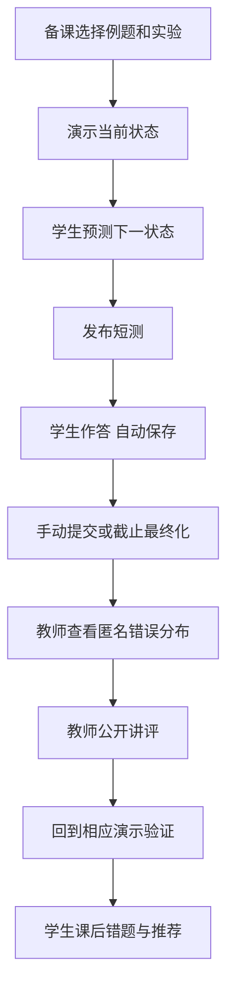

# 页面设计与课堂流程

版本：UI 同步 2.1，2026-10-03。以教师课堂演示和随堂测为主，六页视觉布局见 [UI 实施方案](UI实施方案.md)，优先支持计数器、寄存器和状态转换的分析。

## 1 信息架构

| 角色 | 一级入口 | 页面与核心操作 |
| --- | --- | --- |
| 教师 | 课堂 | 班级选择、备课单、进入演示、发起随堂测、签到、查看当前活动 |
| 教师 | 内容 | 章节知识、资源版本、题库、实验案例、问答条目、知识图谱 |
| 教师 | 学情 | 测评讲评、出勤、学习资源、实验统计、学习预警、CSV导出 |
| 学生 | 我的课堂 | 当前演示、待作答随堂测、签到、预习任务 |
| 学生 | 学习与练习 | 章节、收藏、课程问答、自由练习、错题、推荐与知识图谱 |
| 学生 | 实验 | 预置案例、状态预测、提交反馈和个人记录 |
| 管理员 | 管理 | 用户、角色、班级、入班关系 |

首屏不堆砌饼图。教师登录后显示所选班级、当前课堂和快捷操作；学生登录后优先显示本班活动与继续学习。未入班时说明班级状态，仍可浏览当前可见课程，不把班级为空解释为课程为空。

## 2 当前页面路由

| 路由 | 页面名称（路由标识） |
| --- | --- |
| /teacher/experiments | teacher-experiments |
| /student/analytics | student-analytics |
| /student/labs | student-labs |
| /teacher/labs | teacher-labs |
| /labs/sessions/:id | lab-session |
| /student/labs/:id/upload | lab-upload |
| /student/lab-records | student-lab-records |
| /teacher/lab-records | teacher-lab-records |
| /lab-attempts/:id | lab-attempt |
| / | home |
| /login | login |
| /register | register |
| /profile | profile |
| /teacher/classroom | teacher-classroom |
| /teacher/demos/:id | teacher-demo |
| /teacher/demos/:id/present | teacher-demo-present |
| /student/demos | student-demos |
| /student/demos/:id | student-demo |
| /student/experiments | student-experiments |
| /student/experiments/:id | student-experiment |
| /student/attempts | student-attempts |
| /student/recognition | student-recognition |
| /teacher/attendance | teacher-attendance |
| /teacher/experiment-stats | teacher-experiment-stats |
| /student/classroom | student-classroom |
| /teacher/content | teacher-content |
| /student/learning | student-learning |
| /student/knowledge/:id | student-knowledge |
| /teacher/analytics/learning | teacher-learning-analytics |
| /teacher/analytics/attendance | teacher-attendance-analytics |
| /teacher/warnings | teacher-warnings |
| /teacher/lesson-plans | teacher-lesson-plans |
| /teacher/questions | teacher-questions |
| /student/practice | student-practice |
| /student/assessments/:id | student-assessment |
| /student/results/:submissionId | student-result |
| /student/mistakes | student-mistakes |
| /student/recommendations | student-recommendations |
| /teacher/assessments | teacher-assessments |
| /teacher/paper-generations | teacher-paper-generation |
| /teacher/assessments/:id | teacher-assessment |
| /admin/users | admin-users |
| /admin/classes | admin-classes |
| /admin/classes/:id/enrollments | admin-enrollments |
| /teacher/qa | teacher-qa |
| /student/qa | student-qa |
| /knowledge-graph | knowledge-graph |

教师实验管理页已接通，只允许教师进入：选择本人实验进行编辑，或新建实验并设置初态、说明和输入序列；草稿对学生隐藏，发布后进入学生实验中心。编辑携带当前version，409后保留未保存内容，明确重新载入才替换；他人公开实验只读。学生学习分析为本人记录展示，不使用教师班级分析接口。路由守卫改善体验，后端仍独立鉴权。

## 3 演示台布局

```text
模6计数器                 班级：软件工程示例班       已同步 版本12
知识点入口 | 选择案例 | 预测模式 | 投屏 | 发起随堂测
┌──────────────────────┬────────────────────┐
│ 电路示意和输入开关    │ 当前状态 Q3Q2Q1Q0  │
│ CLK / EN / RESET      │ 0101 = 5           │
│ 当前时钟 0           │ 下一状态 [待揭示]  │
├──────────────────────┴────────────────────┤
│ 时序波形：CLK、EN、RESET、Q3、Q2、Q1、Q0  │
│ 当前行：第3拍 输入... 旧状态... 新状态... │
└───────────────────────────────────────────┘
切换时钟半周期 | 复位到初态 | 查看规则 | 状态表
```

控制按钮写明“切换时钟半周期”，避免一次点击被误认为总是一个有效沿。旁边显示本次是上升沿还是下降沿；仅上升沿更新状态。输入 reset 开关属于同步复位信号；“复位到初态”是重新开始整个演示，两者用词与图标分开。

计数器默认模16，可选择模6教学案例。显示二进制和十进制；移位寄存器注明串行输入从 Q3 进入、向 Q0 方向移动。下一状态预测先隐藏，教师切换时钟后逐行揭示，而不是开场一次展示完整答案。

投屏页大字号、高对比、隐藏编辑表单和个人学生成绩，仅显示电路、状态表、波形、题目和匿名选项分布。1366×768 下主操作不用滚动查找。

## 4 随堂测与讲评



学生作答页显示题目进度、倒计时、最后保存时间和提交按钮。网络异常时用明确文案“当前修改尚未保存”，不能只显示旋转图标。提交后显示服务器确认时间；未公开讲评时显示“已提交，等待讲评”，不提前显示对错或分数。

教师统计先显示已提交/应提交人数，再显示逐题正确率与选项分布。多选题选项比例之和可能超过100%，标签注明“选择该项的人数/已提交人数”，不绘制误导性饼图。漏答独立统计。

## 5 其他页面的边界状态

| 状态 | 页面表现 |
| --- | --- |
| 无学生/无数据 | 清楚说明缺少什么，不绘制虚假的0分或0%掌握度 |
| 问答低匹配 | 提示没有可靠匹配，给出章节浏览入口 |
| 组卷题库不足 | 显示缺少的难度或覆盖条件，保留用户输入供调整 |
| 组卷超时 | 提示稍后重试或减少候选范围，不显示“题库无解” |
| 演示版本冲突 | 刷新最新状态，提示教师重试；不自动重放旧动作 |
| 活动结束 | 禁止新保存和提交，显示最终化结果或等待讲评 |
| 资源历史版本 | 显示版本和发布日期，允许查看当前可见的历史版本 |
| 预警样本不足 | 显示缺少的记录类别，不标成低风险或高风险 |
| 图谱无路径或存在环 | 无路径时提示两者无先修关系；有环时标出环上知识点，不展示错误拓扑顺序 |
| 识别格式不符 | 说明未检测到网格或格内非0/1，提示按样例格式重传，不显示猜测状态 |

## 6 视觉与可用性

采用浅色教学界面，主色深蓝，强调色用于当前时钟沿与变化位。颜色不能是唯一编码，同时使用数值、箭头或文字。中文正文使用系统无衬线字体，二进制与状态表用等宽字体。表单有标签，键盘可访问；错误提示靠近字段。手机侧优先保证签到、作答、看结果，复杂波形保留横向滚动，不承诺手机上进行复杂编辑。

首版不需要生成式装饰图片、电路拟真材质或炫技动画。示意图用 SVG/HTML 绘制，数值来自同一状态模型，避免图表与逻辑不一致。

## 7 六页视觉落地

学生首页采用继续学习、知识点卡片、复习建议与右侧电路概览；手机端先显示课堂任务。教师首页采用蓝色横幅、四项真实指标、课堂与快捷操作两栏。课程详情提供六个内容标签，作答采用左侧题目列表与右侧单题区，实验采用按模型筛选的列表与预测工作区。学习分析提供章节完成条、近七个 UTC 自然日实验提交/通过次数与推荐；不将自报完成或推荐分数称为掌握度。

## 8 实验扩展页面

共用现有AppShell/Token和UI精修基线，新增入口“实验箱与电路测评”，保留预测实验。

| 角色/路径 | 内容 |
| --- | --- |
| 学生 `/student/labs` | 四任务、指导、进入接线/模板/上传 |
| 学生 `/labs/sessions/:id` | 带引脚编号的SVG箱、连线/删除/撤销/重做、通断电、开关/时钟、LED/状态/波形、保存回执、结构错误、提交与过程回放 |
| 学生 `/student/labs/:id/upload` | 模板/端口、circ选择、错误、排队/运行/故障和结果入口 |
| 学生 `/student/lab-records`、`/lab-attempts/:id` | 本人历史、任务/模式过滤、分数/通过数/首错、过程或原文件下载 |
| 教师 `/teacher/labs`、`/teacher/lab-records`、`/lab-attempts/:id` | 本班汇总/学生提交筛选、只读过程及文件结果；无分母显示— |
| 教师 `/labs/sessions/:id` | 教师新建实验箱演示会话、接线/开关/时钟，投屏不含学生身份与成绩 |

学生流程：空箱接线→开电检查→开关/时钟→保存提交→首错纠正；或模板→桌面编辑→上传→真实测评。状态区分未供电、未知/浮空、接线阻塞、未保存、排队、运行、错误电路和服务故障。手机允许接线横滚/缩放，上传、结果及关键按钮可用；1366×768工作台按钮不遮挡。不另定视觉风格。
