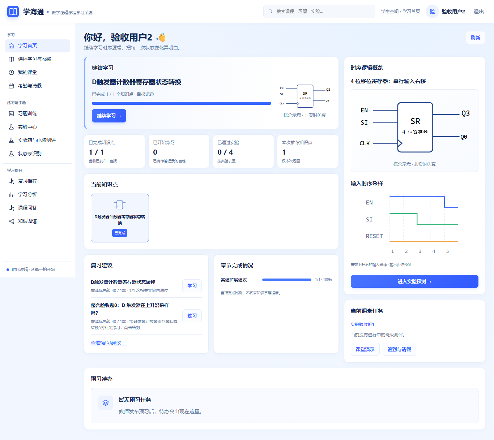
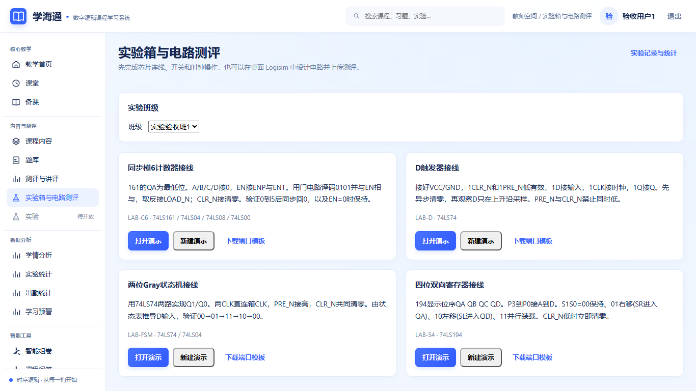
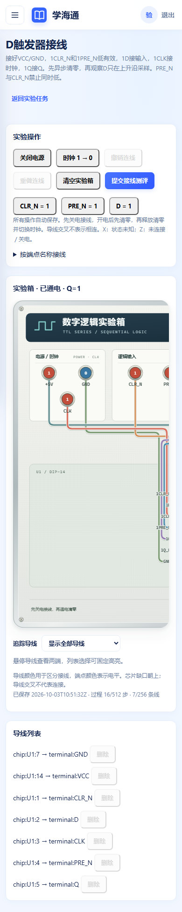

# UI 与实验箱整合检查记录

日期：2026-10-03。对象：PR #53 与 PR #60 的本地整合版本。两份 PR 均未合入 develop；本记录说明组合后的验证结果，不改变旧模块报告的证据范围。

## 1 核对范围

| 分支 | 核对的提交 |
| --- | --- |
| develop | c452c05e14973de184269a48b12eaf0a633dd886 |
| feature/final-ui-polish，PR #53 | 711752deaa0912964c047b6652b948b78029b6e4 |
| feature/lab-extension，PR #60 | ab1d28effdc29738f8e6de49e311b36846bbe7e2 |

整合分支为 `integration/ui-labs`，在独立工作树中完成。两份来源分支均保留；测试使用全新 SQLite 数据库、独立上传目录、真实 Waitress 与生产构建，不读取既有运行数据。

## 2 冲突处理

共有七个冲突文件：导航、路由、导航测试、README、CHG-RB、实施计划、页面与课堂流程。保留 UI 分支的分组导航与学生个人学习分析，把实验箱入口分别放入学生“练习与实验”和教师“内容与测评”分组，保留七条实验扩展路由及原入口高亮。导航测试同时覆盖两项功能。

两份文档增量均保留，章节编号与页面路径同步为实际路由；README 测试数量按本次结果更新。APIC 自动合并后仍保留 AttemptResult 的只读 created_at 以及实验扩展 E071—E082；同步修正已实现接口的状态说明。数据库只有实验扩展的 0012_spec018，未增加第二条迁移链。

原有六页 UI 源码、实验箱绘制/走线算法及两套服务端仿真规则均保持来源分支的实现。

## 3 实测结果

| 检查 | 结果 |
| --- | --- |
| npm ci | 成功；锁定依赖安装完成 |
| npm run test:unit | 36 文件、225 条全部通过 |
| npm run build | 成功，767 modules transformed |
| 原有 SPEC-013、实验扩展 API/接线/文件/worker/备份与迁移回归 | 69 passed，102.86 秒；启用真实 Java/Logisim 项，无跳过 |
| 数据库新空库升级与测试库迁移往返 | 单 head 0012_spec018，通过 |
| 四种实验箱的实际鼠标操作 | D 7 条、模6计数器33条、寄存器16条、FSM15条连线；撤销/重做、刷新恢复、提交均成功，四条结果均100分 |
| 导线追踪 | 计数器实际悬停与下拉固定高亮；恰好两个端点高亮，其余线降低透明度；取消追踪成功 |
| 新版导航与搜索 | 教师/学生对应分组内可进入四任务；搜索“实验箱”进入任务页；接线、上传、记录、结果页高亮正确 |
| 原有课程与实验 | 六标签键盘切换、完成标记保存成功；旧逐拍预测服务端提交并显示标准/预测 Q 对照，created_at 为服务器时间，伪造时间422 |
| 原有作答流程 | 两题分别选A/B；自动保存、上一题/下一题与刷新保留答案，服务端最终判分1/2 |
| 实际 circ 上传 | 上传真实 LAB-D.circ 返回202，经持久队列与5.0.0 worker得到100分；新版结果页正常 |
| 手机390px | 抽屉选择实验箱后关闭；首页、任务、学习分析、接线无整页横向溢出；实验箱内部横滚正常 |
| 页面脚本错误 | 两组实际浏览器流程均为空 |

浏览器使用 Chromium 的真实点击、键盘、文件选择和页面请求；部分测试资料由接口创建，均为隔离模拟资料。参考电路只用于验收，不随产品向学生下发。前端测试中既有 ECharts/jsdom 缺少 canvas 的提示仍存在，测试全部通过；实际浏览器未出现页面脚本错误。

本轮只运行与组合变化相关的69条后端回归，没有重新执行整套后端测试、局域网/HTTPS或课堂负载。本轮 GitHub 没有配置检查项，不能将本机通过称为 CI 通过。UI 分支本身的范围与历史证据见 [UI参考图验收报告](UI参考图验收报告.md)，实验扩展的完整证据见 [实验扩展验收报告](实验扩展验收报告.md)。

## 4 整合页面

以下为本次整合服务的实拍，所有数值来自隔离测试数据库。

