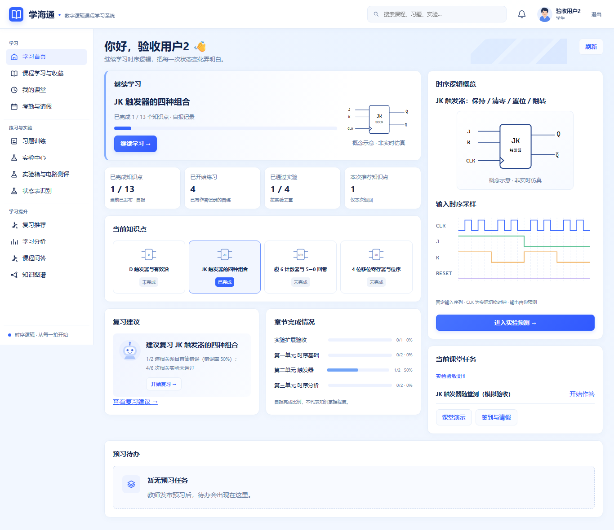
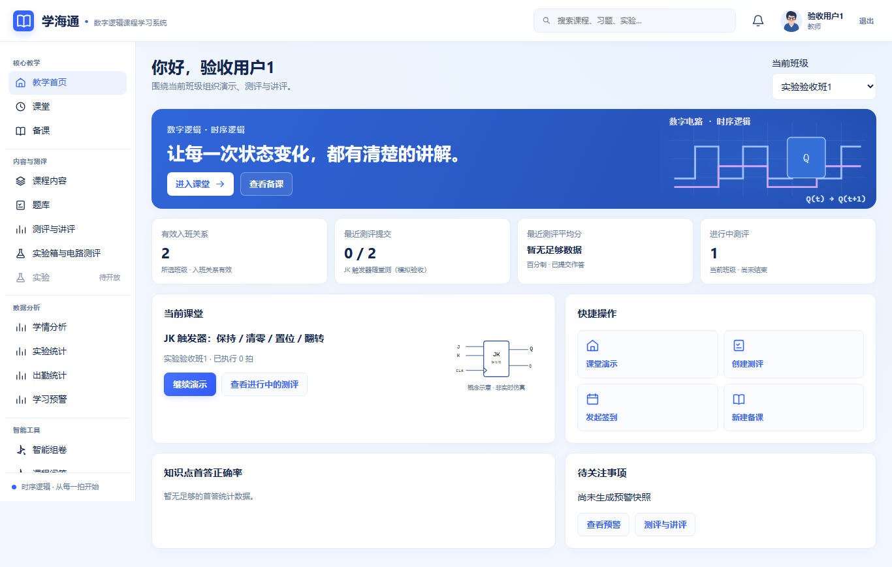
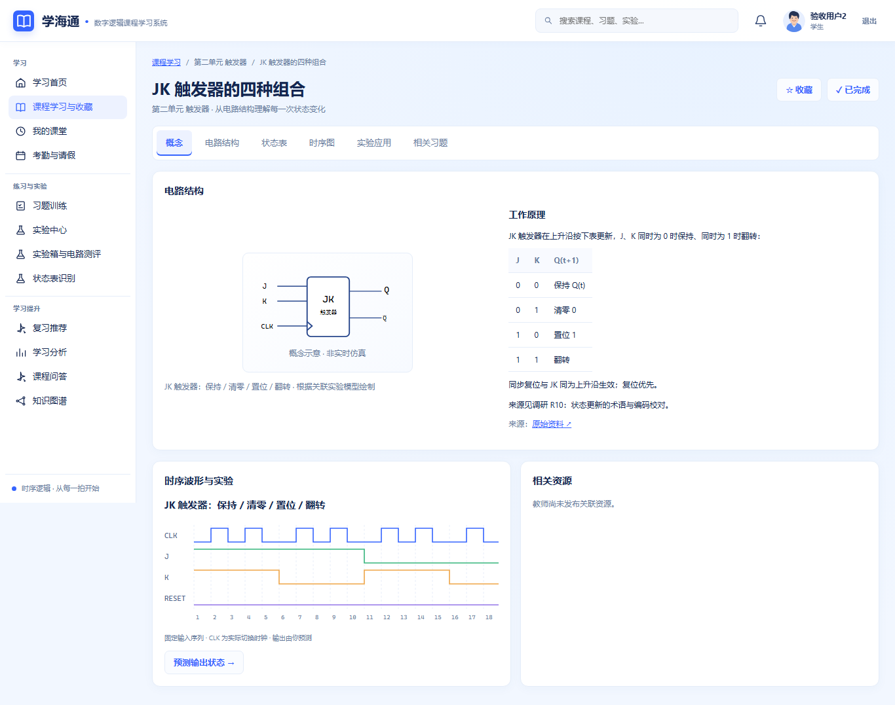
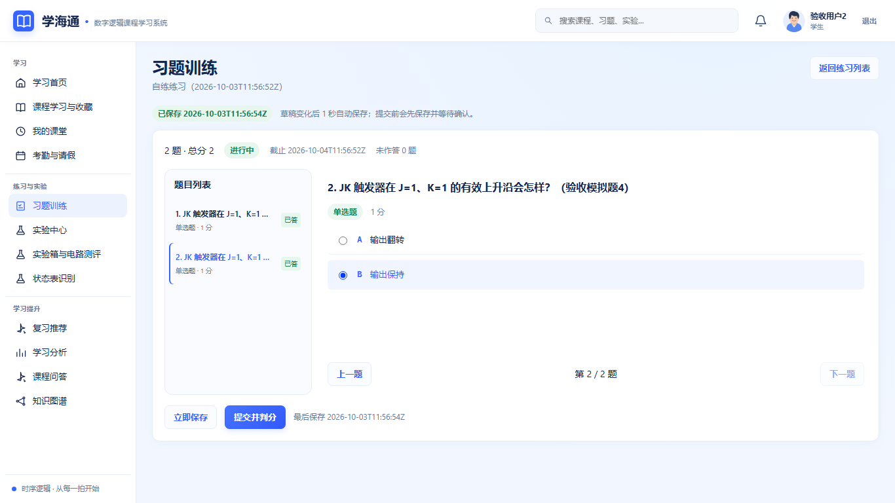
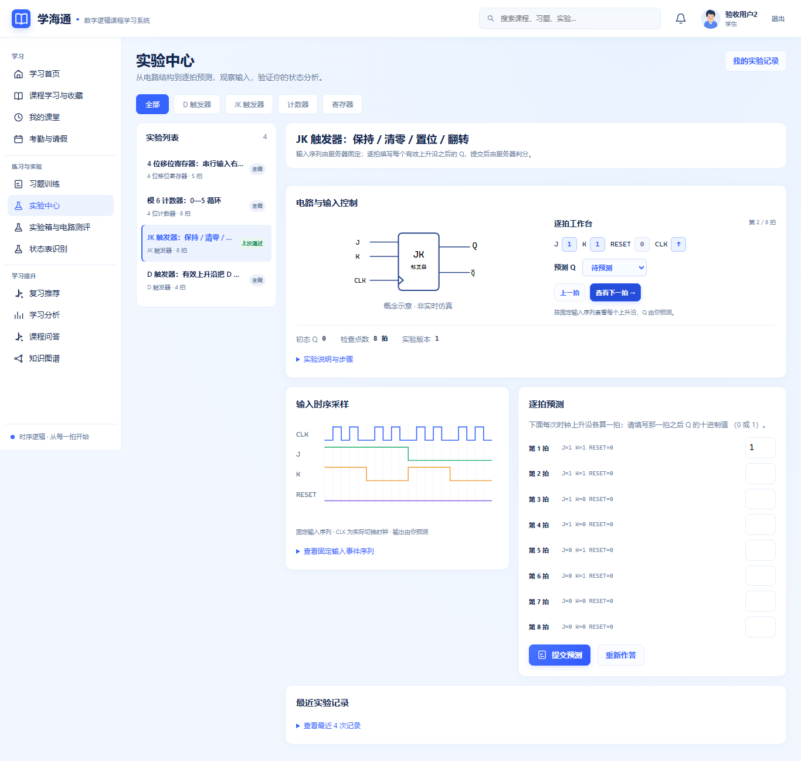
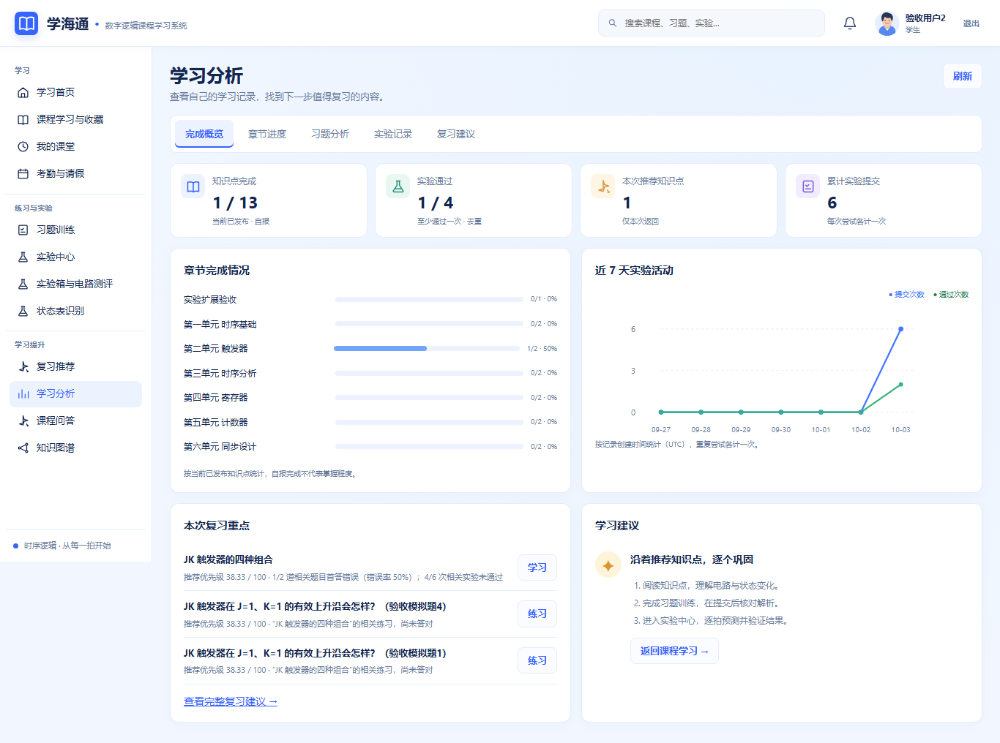

# 六页效果图实现检查记录

日期：2026-10-03。基线为已合并 UI 与实验扩展的 `develop@48bee9e`，本次检查的实现提交为 `0fcf5c8ea391d1a3c5fecec9abe8c8fd7db1c029`。页面以[六页视觉参考](../design/六页视觉参考.png)为依据，所有实拍来自真实构建页面与隔离模拟数据库。后续文档提交不改变本次检查的源码。

## 1 页面对应

| 参考页 | 最终实现与操作 |
| --- | --- |
| 学生首页 | 继续学习、四项记录指标、四种模型关联知识点卡片、复习建议与章节进度；右侧为关联电路及完整输入波形。1024px 保留两栏，手机优先课堂任务。 |
| 教师首页 | 蓝色课堂横幅、四项班级指标、当前课堂的电路概览、2×2 快捷操作、首答统计与预警入口。没有提交记录时显示空态。 |
| 课程学习 | 六个标签页；概念页将电路结构和课程正文放在同一张宽卡片中，下方分别显示波形与真实资源。正文仍经过安全 Markdown 渲染。 |
| 习题训练 | 条件生成页与作答页保持分工；题号列表、单题选项、上一题/下一题、自动保存和最终提交均走已有真实接口。 |
| 实验中心 | 模型筛选、左侧实验列表、右侧电路与逐拍工作台；查看固定输入、选择本拍 Q、完整作答表、提交与历史记录联动。 |
| 学习分析 | 五个标签、四项真实记录指标、章节进度条、七日提交/通过双曲线、习题记录与复习建议。图表可通过鼠标或键盘查看当日次数。 |

公共顶栏增加通用角色插画头像和“课堂动态”入口。教师读取全部有效任教班级的进行中/待开始测评，学生读取本人可见测评；没有虚构未读数。侧栏角色权限与实验箱入口保留。

参考图中的样例数值不作为真实统计。当前系统没有可靠的学习时长、掌握度口径，因此展示自报完成、实际提交及通过记录，并保留口径说明。教师实验管理仍为可选计划入口，未把它伪装成已完成页面。

## 2 行为与数据边界

- 逐拍工作台只改变查看位置和用户预测，与完整作答表使用同一份答案数组。它不计算 Q，不调用第二套仿真器，也不修改教师固定输入序列。
- 输入波形从已下发的 `input_sequence` 绘制真实 CLK 切换与输入电平；不在提交前展示标准 Q。紧凑概览完整显示不超过 32 个事件；更长序列保留内部滚动。
- 提交只包含原有 `experiment_version`、`predictions`、`request_key`。提交中及已保存结果锁定编辑，重新作答后恢复；判分和历史记录仍采用服务端结果。
- 没有后端、迁移、依赖、API/DBD 或业务契约变更。数据库仍为单 head `0012_spec018`，虚拟实验箱和原有同步时序模型各沿用原规则。

## 3 检查结果

| 检查 | 实际结果 |
| --- | --- |
| 前端单元测试 | 40 个文件，236 passed；本次新增 11 项，含多班课堂动态、逐拍联动、锁定/重新作答、输入波形及知识点筛选。 |
| 生产构建 | `npm run build` 成功，776 modules transformed。 |
| 相关后端回归 | SPEC-013、实验箱引擎/API、circ 校验与真实引擎、worker、备份、迁移：69 passed，85.23 秒；启用 `LAB_REAL_ENGINE=1`，无跳过。 |
| 六页响应式 | 1366×768、1024×768、390×844 均完成真实浏览器检查，18 个页面尺寸组合全部满足 document.scrollWidth = viewport width。 |
| 作答流程 | 两题分别选择 A/B → 自动保存 → 切题 → 刷新恢复 → 提交判分，均成功。 |
| 实验流程 | 工作台选择本拍 Q 同步到作答表 → 提交 → 显示服务器对照 → 已保存预测不可改 → 重新作答 → 根据反馈改正后再次提交并通过。 |
| 课堂动态与导航 | 教师/学生读取真实班级测评，Esc 可关闭；390px 抽屉进入实验箱后自动关闭。 |
| 个人分析 | 真实练习记录可继续/查看；实验累计与通过次数随提交更新；五个标签可切换。 |
| 实验箱回归 | D 7 条、模6计数器33条、寄存器16条、FSM15条线均用实际鼠标连接，四任务提交均100分；撤销、重做、刷新和只读回放正常。 |
| 导线追踪 | 实际悬停与下拉固定高亮恰好两个端点，其余导线降至0.16透明度；取消追踪正常。 |
| 文件测评回归 | 实际选择 LAB-D.circ → 上传202 → 持久队列 → 真实 Logisim-evolution 5.0.0 worker → 100分。 |
| 差异与文档检查 | `git diff --check` 与文档一致性检查通过。 |
| 页面脚本错误 | 六页、四实验箱及文件上传流程均无 pageerror。 |

环境：Windows 11、Python 3.14.7、Node 24.18.0；Waitress 同源提供 Vite 构建，Chromium 真实鼠标、键盘与文件选择。验收库和凭据均在项目外，不使用课程实际账号数据。截图是运行页面实拍，没有替换数字或后期拼接界面。

前端测试存在既有 ECharts/jsdom canvas 提示，实际 Chromium 页面没有对应错误。本次未重跑完整后端套件、局域网/HTTPS及课堂负载；相关历史验收范围见 [D7 报告](D7-集成验收报告.md) 与[实验扩展报告](实验扩展验收报告.md)。GitHub 未配置检查项，本机通过不称为 CI 通过。

## 4 实拍索引

| 页面 | 1366px | 1024px | 390px |
| --- | --- | --- | --- |
| 学生首页 | [桌面](六页效果图实现截图/student-home-1366.png) | [中等桌面](六页效果图实现截图/student-home-1024.png) | [手机](六页效果图实现截图/student-home-390.png) |
| 教师首页 | [桌面](六页效果图实现截图/teacher-home-1366.png) | [中等桌面](六页效果图实现截图/teacher-home-1024.png) | [手机](六页效果图实现截图/teacher-home-390.png) |
| 课程学习 | [桌面](六页效果图实现截图/student-course-1366.png) | [中等桌面](六页效果图实现截图/student-course-1024.png) | [手机](六页效果图实现截图/student-course-390.png) |
| 习题作答 | [桌面](六页效果图实现截图/student-answer-1366.png) | [中等桌面](六页效果图实现截图/student-answer-1024.png) | [手机](六页效果图实现截图/student-answer-390.png) |
| 实验中心 | [桌面](六页效果图实现截图/student-experiments-1366.png) | [中等桌面](六页效果图实现截图/student-experiments-1024.png) | [手机](六页效果图实现截图/student-experiments-390.png) |
| 学习分析 | [桌面](六页效果图实现截图/student-analytics-1366.png) | [中等桌面](六页效果图实现截图/student-analytics-1024.png) | [手机](六页效果图实现截图/student-analytics-390.png) |

补充：[逐拍服务端判分结果](六页效果图实现截图/student-experiment-result-1366.png)、[计数器导线追踪](六页效果图实现截图/counter-traced.png)、[真实电路上传结果](六页效果图实现截图/logisim-result-1366.png)。

## 5 修复记录

实际浏览器发现首页右栏被输入波形的最小内容宽度撑出屏幕。已为嵌套网格设置可收缩列，并为概览绘制完整的紧凑波形；最终三尺寸复验无整页溢出。另统一工作台与作答表的提交锁定，避免显示已保存结果时仍可改变预测。

预览服务最初在构建产物生成前启动，只注册了 API，页面路由404；构建完成后重新启动同源服务，以上浏览器证据均来自正确提供构建页面的服务。
