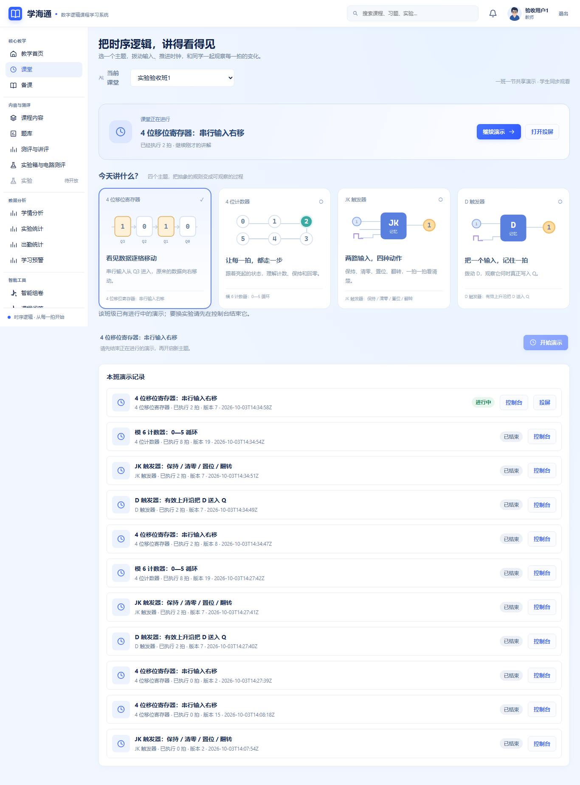
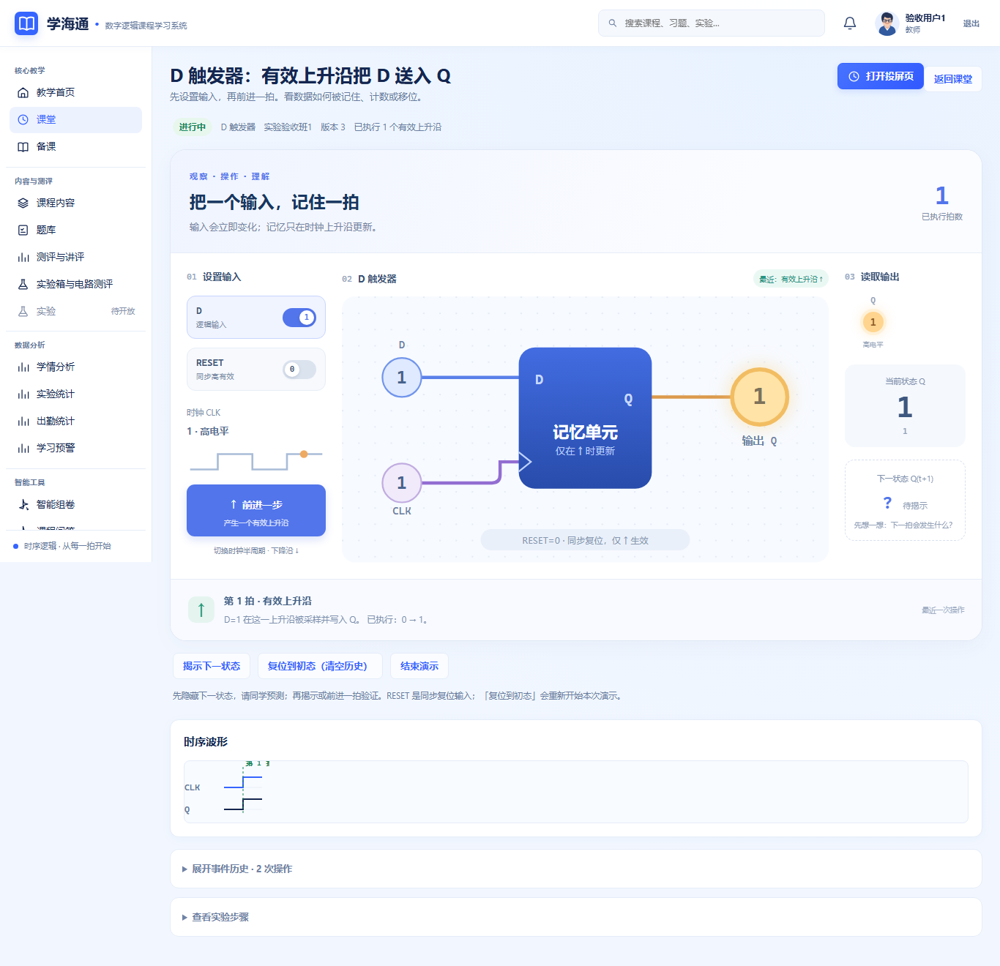
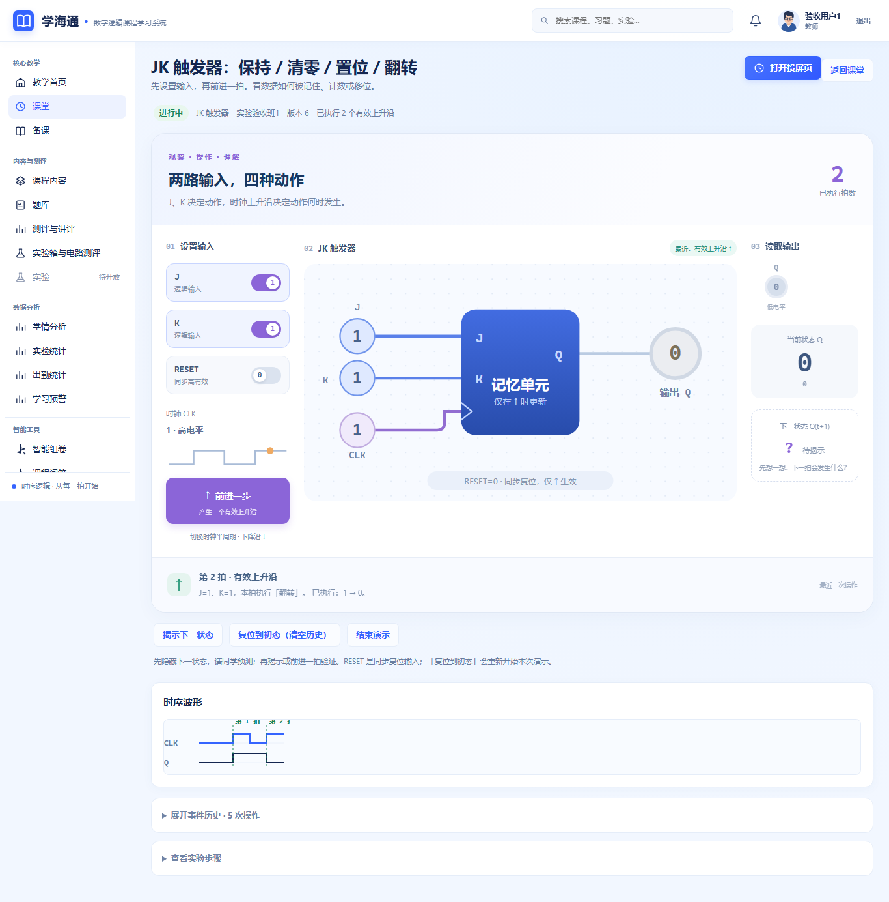
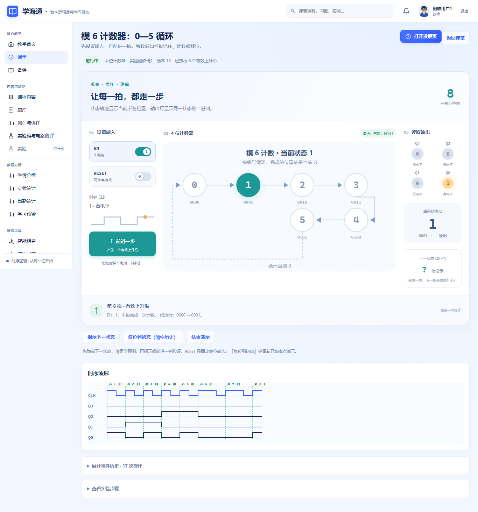
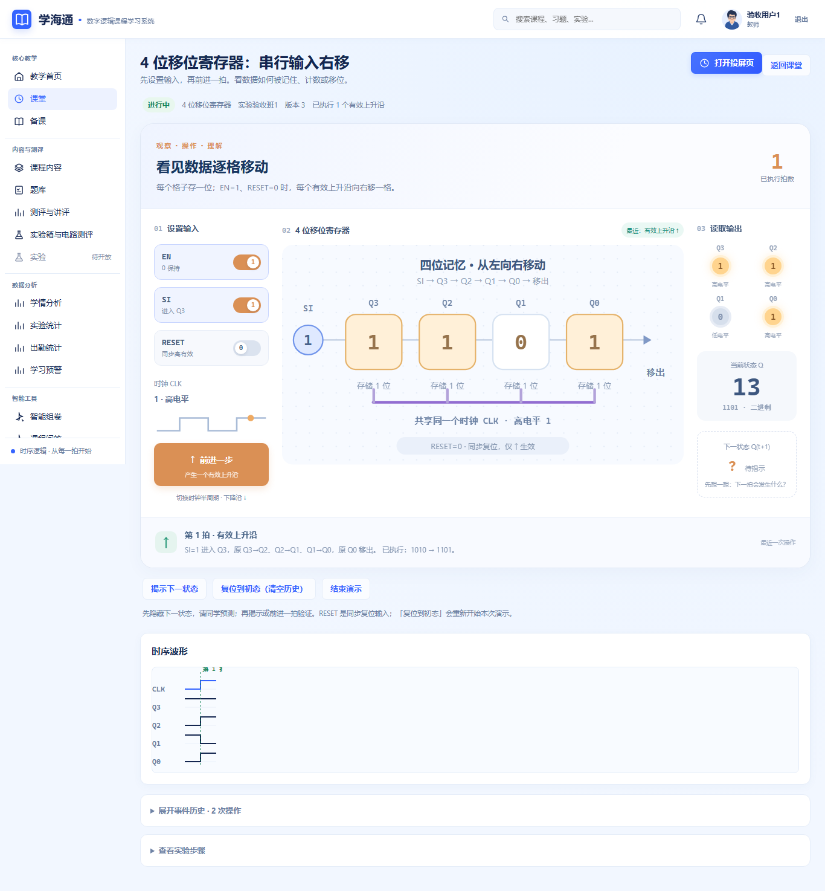
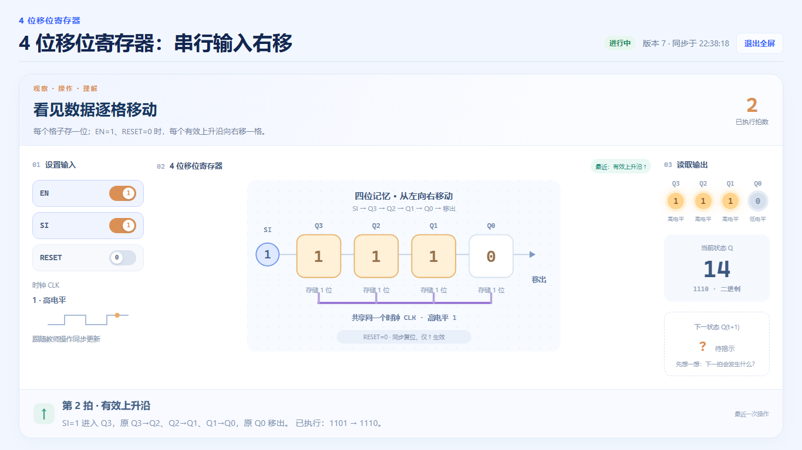
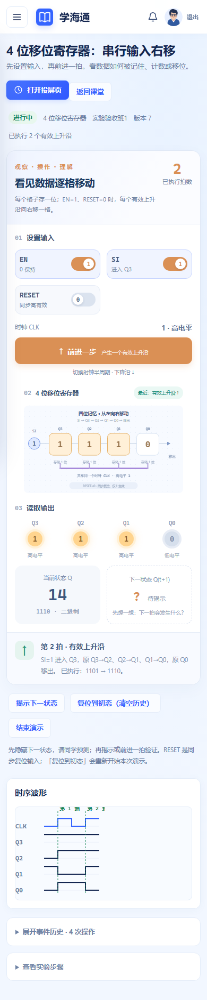

# 课堂演示可视化检查记录

日期：2026-10-03。基线：develop a3f17dd，分支 feature/classroom-visual。验证使用项目外独立数据库和本分支的前端构建产物，通过 Waitress 同源提供页面；测试账号及班级均为演示样本。

## 改动

- 课堂入口以四个主题卡选择已发布实验，开启后直接进入控制台；已有演示可继续或投屏。
- 共用的演示台展示输入开关、时钟、模型图、输出灯、二进制/十进制状态、受预测开关控制的下一状态和最近一次操作解释。
- D/JK 图显示输入与记忆通路；计数图按配置模数标出状态路径、当前位置和回零连线；移位图按 Q3—Q0 显示位值，并回放已执行的输入和旧位值。
- 新增“前进一步”：低电平时一次请求，高电平时先下降再上升；每个请求采用上一回执版本，冲突后停止并刷新。输入和半周期操作仍保留。
- 教师控制台把历史和步骤放入展开区域；学生同步页使用同一只读画面；投屏独立显示并支持浏览器全屏。
- 未新增 API、数据库迁移、依赖或另一套仿真规则。下一状态仍只来自服务端；短动画表示已发生动作的教学回放，不表示真实传播延迟。

## 自动检查

| 检查 | 实际结果 |
| --- | --- |
| npm run test:unit | 42 文件、253 项通过；比基线新增17项，覆盖预测隐藏、只读显示、动作串行、冲突停止和移位回放 |
| npm run build | 成功，781 modules transformed |
| python -m pytest tests/backend/test_spec012.py -q | 19 passed，93.57秒 |
| git diff --check | 通过 |

前端测试仍有既有 ECharts/jsdom 的 canvas getContext 提示，测试退出码为0；此次没有新增 canvas 依赖。后端执行的是课堂演示相关回归，不代表重跑全部后端测试。

## 浏览器实际操作

使用 Chromium 原生按钮点击、输入与路由导航，未替换 API 返回值。

| 流程 | 实际结果 |
| --- | --- |
| D 设置输入/上升沿/下降沿/同步复位 | D=1后Q保持0；前进后Q=1；下降沿保持1；RESET=1后仍保持1，到下一上升沿回0 |
| JK 的 J=K=1 | 连续前进得到0→1→0；第二次前进从高电平先下降再上升 |
| 模6计数 | 连续6拍得到1、2、3、4、5、0；EN=0前进保持0；恢复EN=1后到1 |
| 移位 | 初态1010、SI=1，一拍后1101；再前进到1110 |
| 预测隐藏/揭示 | 隐藏时无下一状态节点；揭示后显示服务端1110；再次隐藏后节点消失 |
| 学生同步 | 同班学生只读页由1101同步到1110，没有输入或时钟操作按钮，隐藏预测未显示 |
| 投屏 | 无应用侧栏和账号导航；浏览器全屏进入/退出成功，首屏包含本拍解释 |
| 响应式 | 1366×768、1024×768、390×844；课堂入口、四种教师演示、学生观看、投屏均无整页横向溢出 |

三尺寸共21个页面组合，另检查1366全屏；浏览器结果为28项检查通过，pageerror为空。波形及历史表可在自身容器横向滚动，手机演示台纵向排列。

## 页面实拍

## 限制

此次未开展真实师生课堂试用、局域网或投影仪测试。学生和投屏仍采用既有3秒轮询；若两次轮询间教师进行了多次操作，画面解释最新一条事件，完整过程可查看历史。高电平“前进一步”为两个独立请求，若第二个请求失败，第一次下降沿会保留，页面刷新展示服务端真实状态。128事件上限沿用原规则。

截图为隔离演示数据，不作为真实课程使用记录。历史检查报告保留其原始基线和结果，不替换为本次数据。
